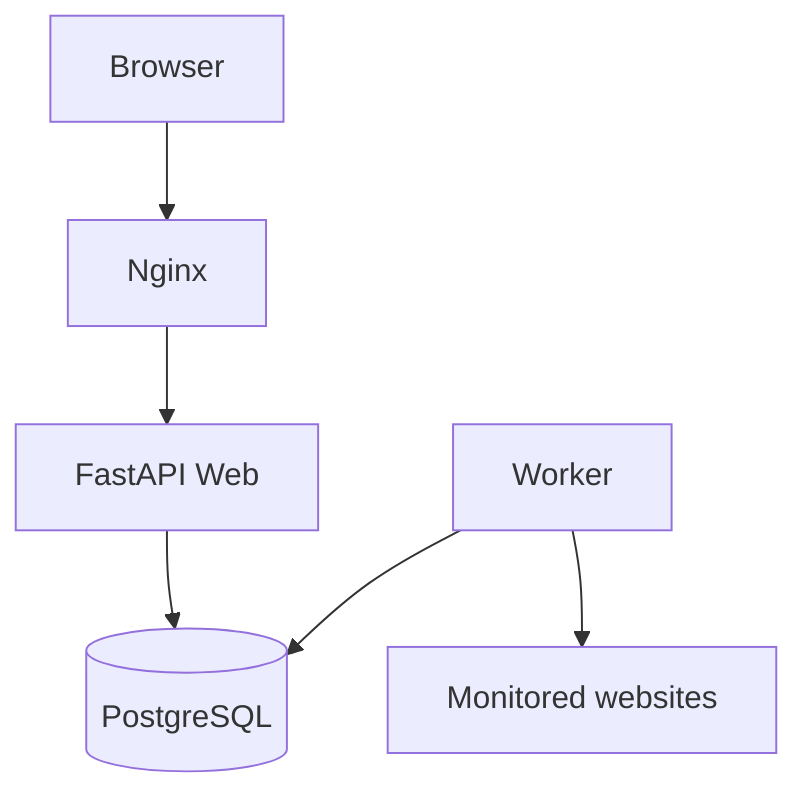

# OpsBeacon

Production-style uptime monitoring platform built as a DevOps portfolio project.

OpsBeacon is a public demo app for monitoring HTTP services. It uses FastAPI, PostgreSQL, Docker Compose, a separate worker process, Nginx, Ansible, and GitHub Actions.

## Features

- Dashboard with service status, HTTP code, latency, last check, history, and uptime percentage
- Public monitor CRUD API
- Manual `Run check` button
- Periodic worker checks
- Idempotent demo seed data for GitHub, Cloudflare, and Python
- `/health` database check and `/version` deployment metadata

## Architecture



V1:

```text
Internet -> Nginx -> FastAPI container -> PostgreSQL container
```

## Local Development

```bash
cp .env.example .env
docker compose up --build
```

Open `http://localhost:8000`.

Useful commands:

```bash
make up
make down
make logs
make test
make lint
make migrate
make seed
```

## API

```text
GET    /api/v1/monitors
POST   /api/v1/monitors
GET    /api/v1/monitors/{id}
DELETE /api/v1/monitors/{id}
POST   /api/v1/monitors/{id}/check
GET    /api/v1/monitors/{id}/history
GET    /health
GET    /version
```

Create a monitor:

```bash
curl -X POST http://localhost:8000/api/v1/monitors \
  -H 'Content-Type: application/json' \
  -d '{"name":"Example","url":"https://example.com"}'
```

## Database Migrations

```bash
alembic upgrade head
alembic revision --autogenerate -m "describe change"
```

The Compose web service applies migrations before starting.

## Configuration

Copy `.env.example` to `.env`. Safe variables:

```text
APP_VERSION
GIT_COMMIT
APP_ENV
DATABASE_URL
HTTP_TIMEOUT_SECONDS
WORKER_INTERVAL_SECONDS
```

Never commit production passwords, AWS credentials, SSH private keys, or `.env`.

## Tests And CI

```bash
pytest
ruff check .
docker compose config
ansible-playbook -i ansible/inventory.example.ini ansible/playbook.yml --syntax-check
```

GitHub Actions runs lint, tests, and Docker image build on pull requests and pushes to `main`.

## AWS EC2 V1 Deployment

Create manually:

1. Ubuntu EC2 instance
2. SSH key pair
3. Security Group allowing `22/tcp` SSH and `80/tcp` HTTP

If HTTPS is configured later, allow `443/tcp`. Do not expose `5432` or `8000` publicly.

Prepare inventory:

```bash
cp ansible/inventory.example.ini ansible/inventory.ini
ansible-galaxy collection install -r ansible/requirements.yml
```

Edit `ansible/inventory.ini`, then run:

```bash
ansible-playbook -i ansible/inventory.ini ansible/playbook.yml
```

Ansible installs Docker, Docker Compose plugin, Nginx, copies the app, starts Compose, and configures Nginx as a reverse proxy to `127.0.0.1:8000`.

## Security Considerations

- Only `http://` and `https://` monitor URLs are accepted.
- Localhost, loopback, link-local, private, reserved, multicast, and unspecified IP literals are rejected.
- TLS verification stays enabled.
- HTTP checks use a timeout.
- PostgreSQL is only inside Docker networking.
- The Docker image runs as a non-root user.

URL monitoring can introduce SSRF risk. V1 blocks obvious internal targets; production systems should add stricter DNS/IP resolution controls and network egress policy.

## Current V1 Limitations

- No authentication or teams
- No alerting
- No HTTPS automation
- No Terraform or managed AWS services
- Worker is a simple loop, not a distributed scheduler

## Planned V2

V2 migrates infrastructure toward:

```text
Terraform
AWS VPC
ECR
ECS Fargate
Application Load Balancer
RDS PostgreSQL
CloudWatch
Route53
ACM
```

Evolution path:

```text
V1: EC2 + Ansible + Docker Compose
V2: Terraform + ECS Fargate + managed AWS services
```
